Wallpaper: <i>The Starry Night</i>, Vincent van Gogh (1889)

# Hi, I'm Daniel 👋

Junior full-stack developer from Palmas, Brazil. I study Computer Science at Ceulp/ULBRA and work as an IT intern at **EGEFAZ**,
the Tocantins State Department of Finance's school, where I'm one of the two developers on the system that runs every
training event for state public servants.

I build with Django, React and TypeScript. Most of my projects start from a real mess (a paper notebook, a spreadsheet,
a race condition) and end with the fix measured and tested. **Open to internships and junior roles.**

  
  
  
  

### 📌 Featured

| Project | The story | Stack |
|---|---|---|
| [**portfolio**](https://bernardes.dev) · live | My site. A name that widens and folds as you scroll, project cards that stack, real screen recordings. Two languages, light and dark, works with the keyboard and with reduced motion. | React · TypeScript · GSAP |
| [**contrato-facil**](https://github.com/Yourdevdaniel/contrato-facil) | A guided questionnaire writes a service contract. Signers sign in order with one-time codes, and every step goes into a SHA-256 audit trail and the final PDF. | Django · React · PostgreSQL |
| [**cafe-verde**](https://github.com/Yourdevdaniel/cafe-verde) | Customers order from the table on their phone; the kitchen and waiter screens update live over WebSockets. | Django Channels · Redis · React |
| [**dublacon**](https://github.com/Yourdevdaniel/dublacon) | A social network where amateur voice actors, animators and artists team up on creative projects. | DRF · React · PostgreSQL |
| [**akira-assistant**](https://github.com/Yourdevdaniel/akira-assistant) | A Telegram assistant that runs on my PC: a pt-BR to-do list by text or voice and a daily Gmail/Calendar digest read aloud. A small local model gets 41 of 41 test phrases right. | Python · Ollama · Whisper · Kokoro |
| [**ConverteAqui**](https://github.com/Yourdevdaniel/ConverteAqui) | Raw lead spreadsheets in; cleaned, deduplicated, scored Excel and PDF out. Two shops with the same name stay separate unless the Maps link proves they are one. | Django · React · Docker |
| [**boardgame-library-db**](https://github.com/Yourdevdaniel/boardgame-library-db) | Two simultaneous loans of the same copy slipped past the trigger; a partial unique index fixed it. A missing FK index made a query ~800x slower. | PostgreSQL · Python · pytest |
| [**PlanejaMes**](https://github.com/Yourdevdaniel/PlanejaMes) · [live](https://planeja-mes.vercel.app) | Monthly budget planner with the 50/30/20 rule, a printable A4 sheet and an interactive 3D scene. | React · Three.js · GSAP |

Smaller ones: [Projeto-Arvore](https://github.com/Yourdevdaniel/Projeto-Arvore) (step-by-step BST visualizer) and
[transit-router](https://github.com/Yourdevdaniel/transit-router) (fewest stops vs fastest trip, BFS against Dijkstra).
Some of my work is private: an app in daily use at a local store and two apps in development.
[My site](https://bernardes.dev/#work) shows what I can share.

### Tech

- **Backend:** Python, Django, Django REST Framework, PostgreSQL, pytest
- **Frontend and mobile:** TypeScript, React, React Native + Expo, Tailwind CSS, GSAP, Three.js
- **Delivery:** Docker, Nginx, Linux, GitHub Actions, Vercel
- **AI:** I work with coding agents (Claude Code, Codex): I split the work into small, clear tasks, give them the right
  context and check every result with tests and real measurements. Locally: Ollama, Whisper and Kokoro TTS.

### Languages

Portuguese (native) · English C1 ([EF SET 66/100](https://cert.efset.org/en/6198Q1)) · Spanish A2

---

<i>“I dream my painting and I paint my dream.” (Vincent van Gogh)</i>

